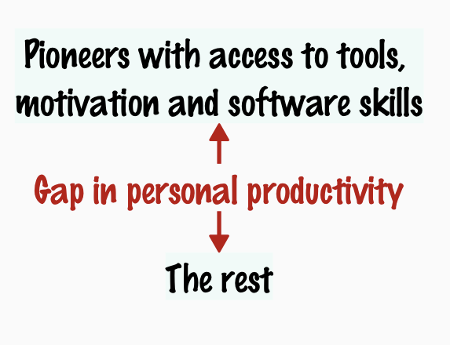
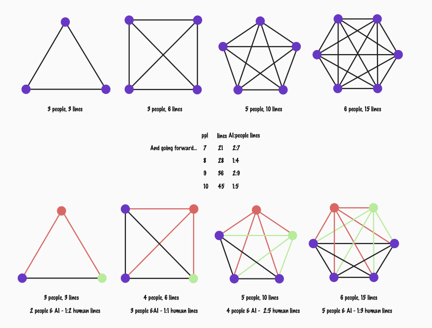

# Filling the Gaps

I am one of those people who can easily write something in an hour, except if I see that in my calendar the next meeting is in an hour. I've considered it one of my quirks to live with, and I compensate by doing my focused work very often outside office hours. With the flexibility of work, it does not matter when I do the lighter bits I wanted to do in my day like catching up on the socials and being available for people who often could use my attention, and that I might do some intensive work at weird hours. 

Other people have more strict lines on work vs. free time. My thinking around work is more on the question on *am I worth my salary this week* than the hours I am available. I have weeks when I absolutely feel like the platform I have built in the past has to do the value creation for me. But mostly I find it possible to show where my value shows up. 

In the last week, a few things happened that brought me to blog and speculate on this: 

1. I realized that I favor spending my building time with AI over people, because people make me feel like they don't understand me. That was not a great realization that I have started to favor two forms of connections: 1:1 with AI, and broadcast with people. The more I let the distance in co-creation grow, the less I want to re-engage to bring others along.  

2. This individual optimization of my time grows the gap between me and my colleagues. The gap is not a positive. The gap shows up in personal productivity and is not in the best interest of the organizations I serve. 

I also made notes on bias in relationships. If I prefer talking to AI, and I prefer keeping my boss in the loop, who do I leave out? How I should design the communications? The more people belong to the team, the more AI in these relationships biases the way our communication works. And the way we use it currently, as individuals in isolation, how it grows the distance. 

Then today I read an article in Finnish that made a few fairly interesting points that I illustrate with my own ideas around them: 

- AI Pioneers may have made significantly different choices on where they invest the time saved up by use of these tools.

    - while my choice may be to invest it in learning more, the article dubbed an idea of "stealing from the boss with AI", meaning the personal productivity used in frame of *was I worth my salary* in a shared frame comparing to non-pioneers may also lead to the conclusion of more private time. 

- Shared experiences build shared requirements. The more individual our experiences become with remote work and favoring AI as a collaborator, the more individualistic the requirements become. This impacts demand, and motivation for systems development. The personal productity differences are increasing the gap in experiences. 

- When pioneers achieve a 4-day work week alone, they may not be inclined to bring everyone else along for the benefit. Individual rankings become the norm, and the wishes towards the great democratization of software development with AI are less achievable. 

- Motivation and IT skills on individual level rather than company structures drive most of the benefits. Rediscovering individual workflows for each individual is the current state and individualism may keep us there.

## Why blog about this?

I remember the times when builds were broken every day, and we could not test. We turned the wait time to improvement time. When we got away from the broken builds with CI/CD systems, we needed to be intentional for collaborative improvement time. 

AI use, and the individual productivity gap in particular, is calling for making space for that intentionality for collaborative improvement time. We need targets that keep most of us along on the ride, rather than letting the individual productivity gap grow. 